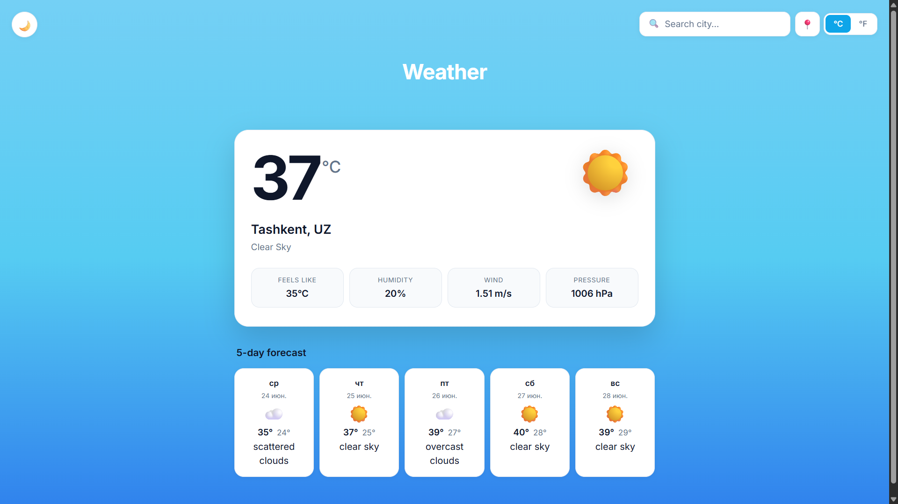
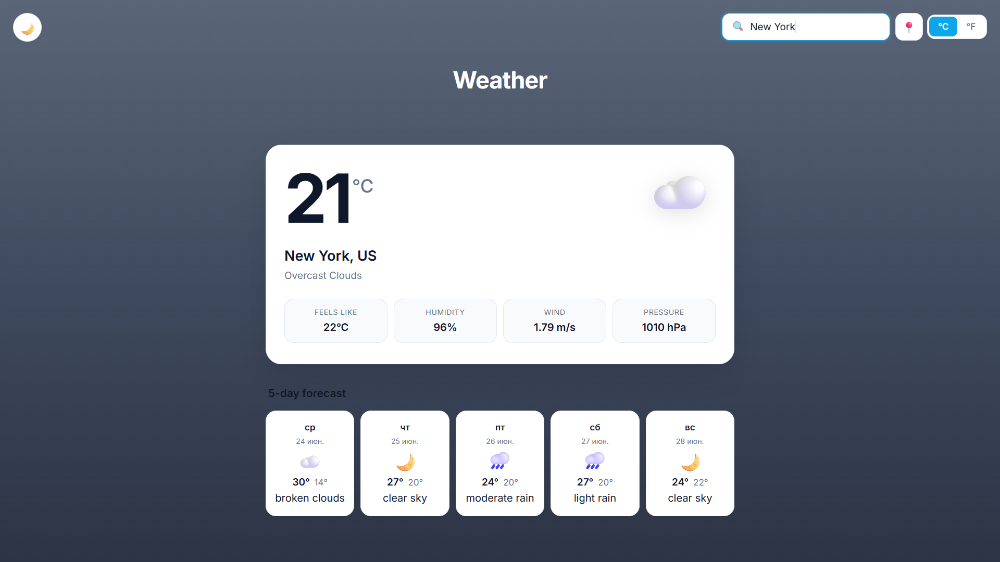
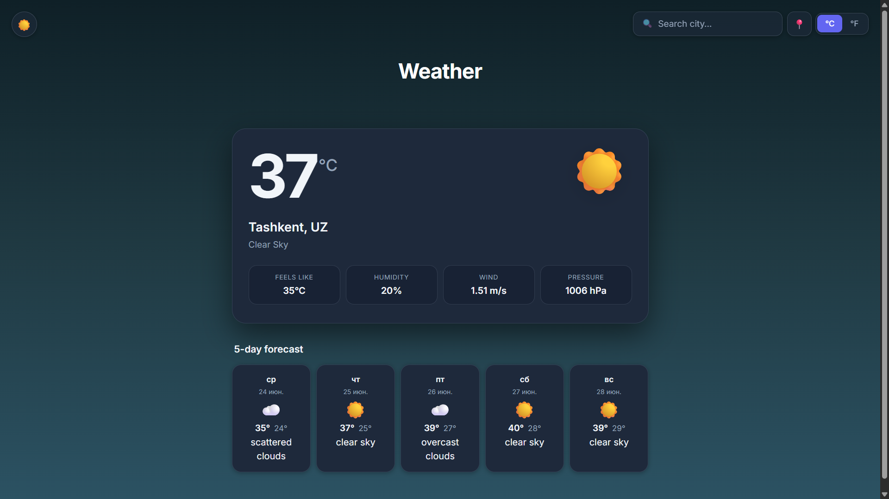
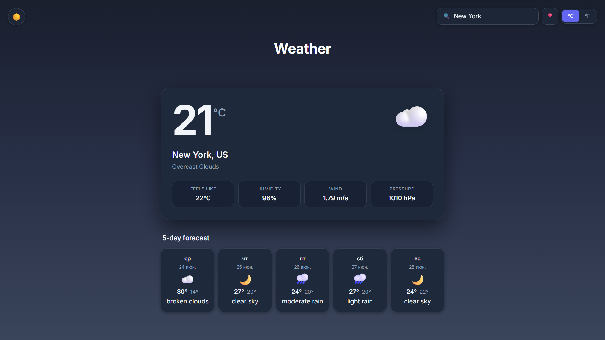

# Weather Forecast Dashboard

A responsive weather dashboard built with HTML, CSS, and JavaScript using the OpenWeatherMap API.

## Features

- Current weather conditions
- 5-day weather forecast
- Search weather by city
- Geolocation support
- Dark/Light mode
- Celsius/Fahrenheit conversion
- Dynamic weather backgrounds
- Responsive design

## Technologies

- HTML5
- CSS3
- JavaScript (ES6)
- OpenWeatherMap API

## Screenshots

### Light Mode





### Dark Mode





## Installation

Clone the repository:

```bash
git clone https://github.com/akbarsobirjonov/Weather-Forecast-Dashboard.git
```

Open `index.html` in your browser.

## Future Improvements

- Air Quality Index
- Hourly Forecast
- Favorite Cities
- Search History
- Weather Charts

## Author

Akbar Sobirjonov